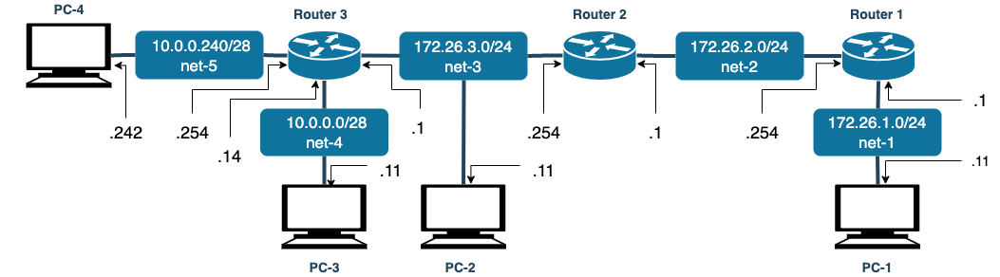

# Network
 

# Ref
- https://qiita.com/tk_n/items/648e225d06085a0e2530
- https://docs.frrouting.org/en/latest/index.html

# How to Start
1. start using `docker-compose`
```
$ sudo docker compose up -d
```

# Balus
```
$ sudo docker compose down --rmi all --volumes --remove-orphans
```